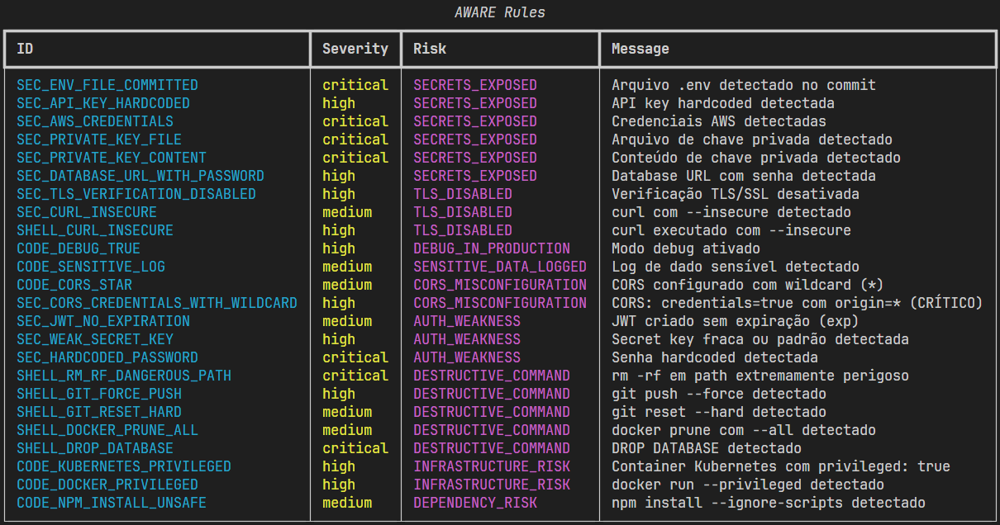
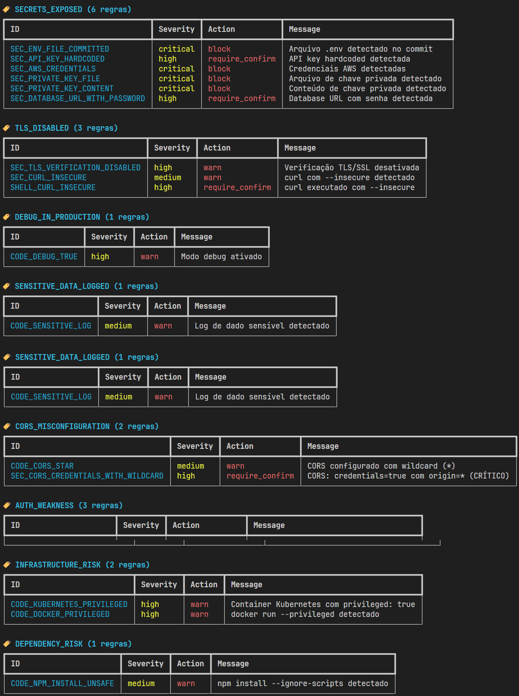
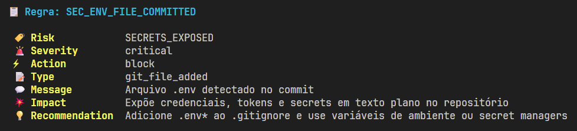

# AWARE

**Cognitive Awareness for Developers** - A security tool that prevents dangerous technical decisions before they happen.

AWARE intercepts risky commands and code patterns, providing graduated warnings and confirmations to help developers avoid security incidents and data loss.

[](https://www.python.org/downloads/)
[](https://opensource.org/licenses/MIT)
[](https://github.com/IamXeoth/aware/releases)

---

## Features

- **25 production-ready security rules** covering 8 risk categories
- **Git hooks** for automated pre-commit and pre-push scanning
- **Shell wrapper** for real-time command interception
- **Multiple output formats** (console, JSON, SARIF, GitHub Annotations)
- **Graduated response system** (warn/confirm/block)
- **Privacy-first design** - 100% offline, zero telemetry

---

## Installation
```bash
git clone https://github.com/IamXeoth/aware.git
cd aware

python -m venv venv
source venv/bin/activate  # Windows: .\venv\Scripts\activate

pip install -e ".[dev]"
```

---

## Quick Start

### List available rules
```bash
python cli.py rules list
```



### View rules by risk category
```bash
python cli.py rules list --by-risk
```



### Explain a specific rule
```bash
python cli.py rules explain SEC_ENV_FILE_COMMITTED
```



### Scan staged files
```bash
python cli.py scan --staged
```

### Install git hooks
```bash
cd /path/to/your/project
python /path/to/aware/cli.py install
```

---

## Rule Categories

| Category | Rules | Description |
|----------|-------|-------------|
| SECRETS_EXPOSED | 6 | API keys, credentials, AWS keys, private keys |
| TLS_DISABLED | 3 | SSL/TLS verification bypasses |
| DEBUG_IN_PRODUCTION | 2 | Debug mode, sensitive logging |
| CORS_MISCONFIGURATION | 2 | Wildcard origins, credentials exposure |
| AUTH_WEAKNESS | 3 | Weak secrets, hardcoded passwords, JWT issues |
| DESTRUCTIVE_COMMAND | 5 | rm -rf, force push, database drops |
| INFRASTRUCTURE_RISK | 2 | Privileged containers |
| DEPENDENCY_RISK | 2 | Unsafe package installations |

---

## CLI Commands
```bash
aware --version              # Show version
aware scan --staged          # Scan staged files
aware scan --diff base...head # Scan diff between refs
aware wrap <command>         # Intercept shell command
aware install               # Install git hooks
aware uninstall             # Remove git hooks
aware status                # Check hooks status
aware rules list            # List all rules
aware rules explain <id>    # Explain specific rule
aware rules validate <file> # Validate custom rules file
```

---

## Output Formats

AWARE supports multiple output formats for different use cases:

- **console** - Rich terminal output with colors (default)
- **compact** - Minimal output for CI/CD pipelines
- **json** - Machine-readable format for integrations
- **sarif** - GitHub Security scanning format
- **github** - GitHub Actions annotations

Example:
```bash
python cli.py scan --staged --format json --output report.json
```

---

## Git Hooks

AWARE provides two git hooks:

**Pre-commit**: Scans staged files before commit
- Blocks commits containing secrets or critical vulnerabilities
- Allows warnings to proceed with acknowledgment

**Pre-push**: Scans diff before push
- Compares local changes against remote branch
- Prevents pushing dangerous code to shared repositories

Both hooks automatically detect and use AWARE if installed, or fall back to direct Python execution.

---

## Shell Wrapper

The shell wrapper intercepts dangerous commands before execution:
```bash
python cli.py wrap rm -rf /important/data
# AWARE will require explicit confirmation before executing
```

Commands are analyzed against the ruleset, and dangerous operations trigger confirmation prompts based on severity.

---

## Configuration

AWARE uses YAML-based rules configuration. The default ruleset is located in `aware/config/default_rules.yaml`.

Custom rules can be provided:
```bash
python cli.py scan --staged --rules custom_rules.yaml
```

Rule validation:
```bash
python cli.py rules validate custom_rules.yaml
```

---

## Architecture
```
aware/
├── cli.py                  # Command-line interface
├── config/
│   └── default_rules.yaml  # Default ruleset
├── core/
│   ├── engine.py          # Core scanning engine
│   ├── formatters.py      # Output formatters
│   ├── models.py          # Data models
│   └── rules_loader.py    # Rule loading and validation
├── hooks/
│   ├── install.py         # Git hooks installer
│   └── templates/         # Hook templates
├── scanners/
│   └── git_diff.py        # Git diff scanner
└── wrappers/
    └── shell_wrap.py      # Shell command wrapper
```

---

## Development

### Running tests
```bash
pytest tests/
```

### Code formatting
```bash
black aware/
ruff check aware/
```

### Type checking
```bash
mypy aware/
```

---

## Use Cases

**Development workflow protection**
- Prevent accidental commits of secrets or credentials
- Block force pushes without explicit confirmation
- Warn about debug code in production paths

**CI/CD integration**
- JSON output for automated security gates
- SARIF format for GitHub Security scanning
- Exit codes for pipeline decisions

**Training and awareness**
- Detailed explanations for each rule violation
- Educational impact and recommendation messages
- Context-aware severity adjustments

**Command safety**
- Real-time interception of destructive operations
- Graduated confirmation based on command risk
- Prevention of accidental data loss

---

## Technical Details

**Language**: Python 3.9+

**Dependencies**:
- typer - CLI framework
- rich - Terminal formatting
- pyyaml - Configuration parsing

**Testing**: pytest

**Build system**: Hatchling

---

## Roadmap

- Unit and integration test coverage
- PyPI package publication
- VS Code extension
- Additional rule packs (language-specific, framework-specific)
- Web-based dashboard for findings visualization
- Custom rule authoring documentation

---

## Contributing

Contributions are welcome. Please ensure:

- Code follows existing style conventions
- Tests are included for new functionality
- Documentation is updated accordingly
- Commit messages are clear and descriptive

---

## License

MIT License - see [LICENSE](LICENSE) for details.

---

## Author

**Vinicius Lisboa**

Email: contato@viniciuslisboa.com.br  
GitHub: [@IamXeoth](https://github.com/IamXeoth)  
Website: [viniciuslisboa.com.br](https://viniciuslisboa.com.br)

Developed as part of [Hummand](https://hummand.com) - GovTech solutions for public sector digital transformation.

---

## Acknowledgments

This project addresses a common gap in development workflows: the absence of real-time feedback on security and operational risks. AWARE is designed to integrate seamlessly into existing toolchains without requiring infrastructure changes or external services.

The ruleset is based on common security patterns observed in production incidents, with emphasis on preventing accidental exposure rather than malicious activity.